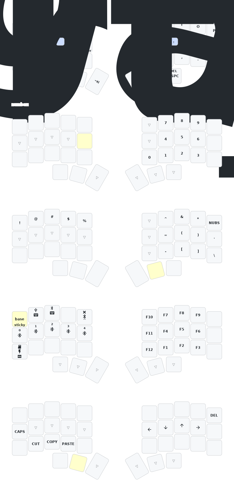

# Cocofi 36-Key Keyboard ZMK Configuration

This repository contains my [ZMK firmware](https://github.com/zmkfirmware/zmk/) configuration for the [Chocofi](https://github.com/pashutk/chocofi) keyboard. The Chocofi is a split keyboard featuring 3 rows, 5 columns, and 3 thumb keys per half, totaling 36 keys.

# Keymap 

The keymap are automtically updated with aksoylar's [keymap-drawer](https://github.com/caksoylar/keymap-drawer)
